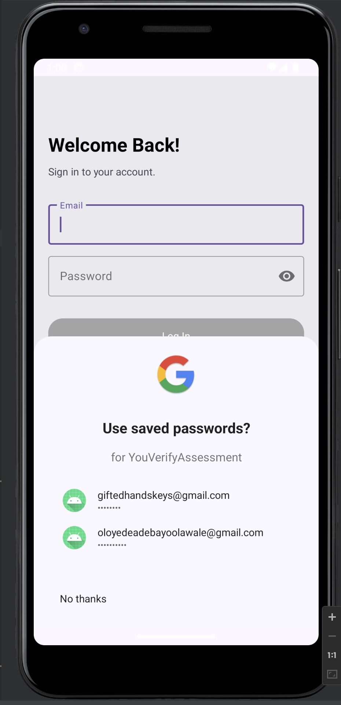
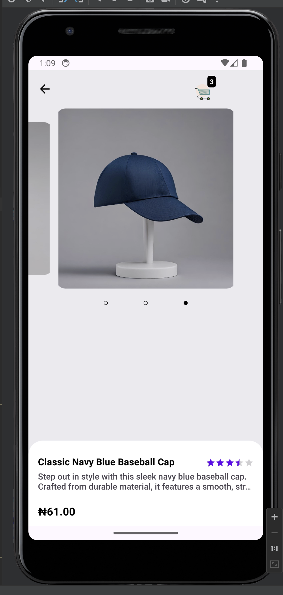
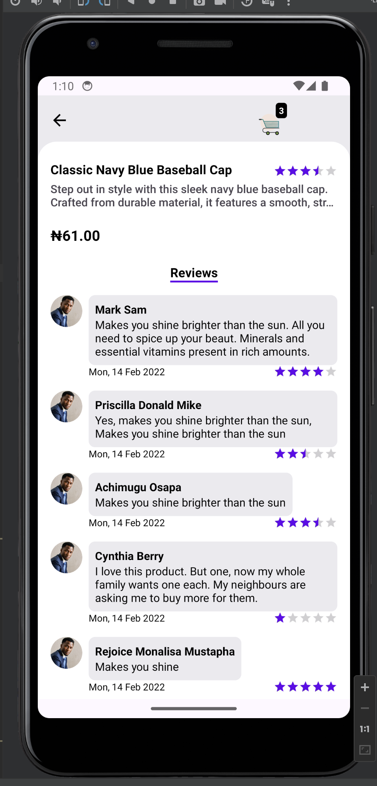
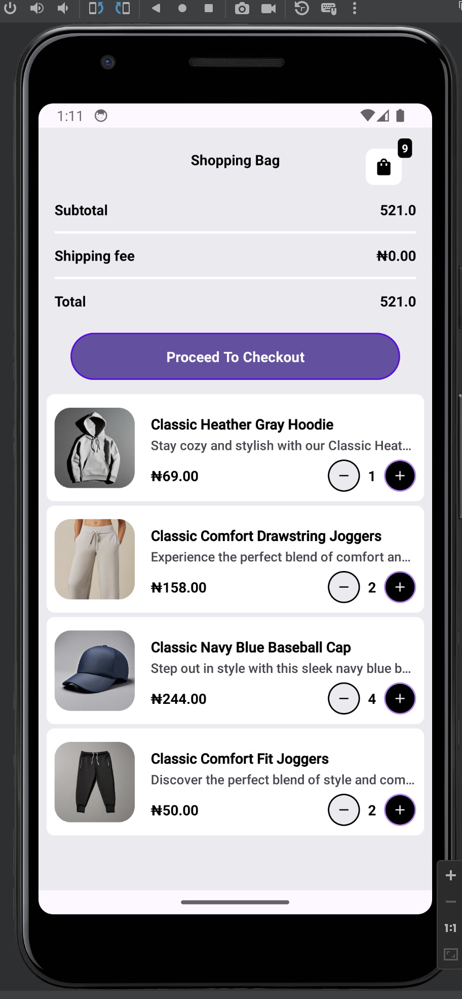
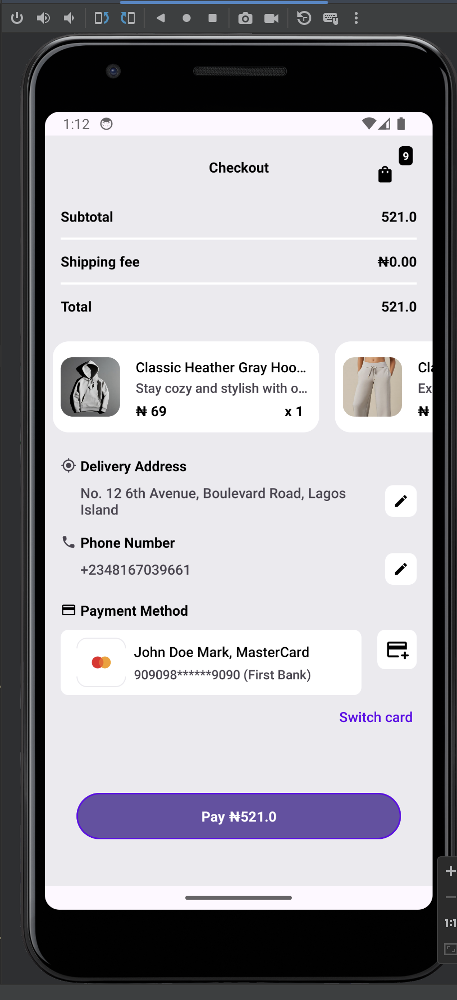
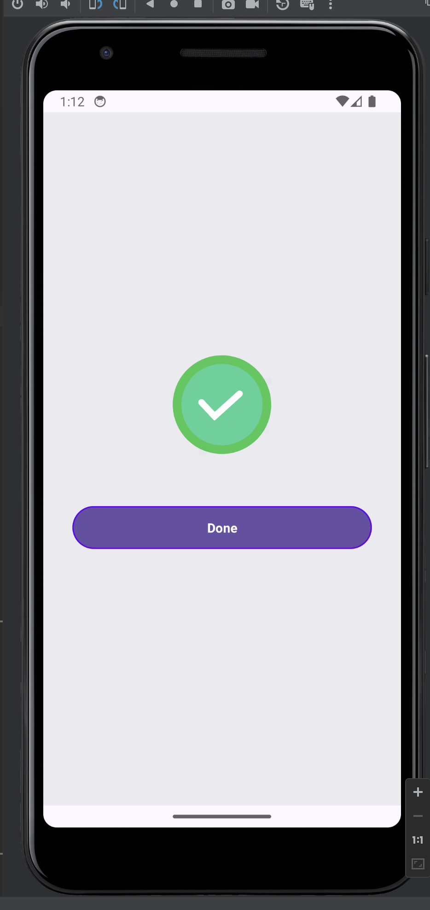

# YouVerify e-Commerce App

An e-commerce application where users can browse products, add items to a cart, and place orders.
This is submitted to [YouVerify](https://www.youverify.co/) for assessment for the role of Senior Android Software Engineer.

YouVerify is a B2B company that builds SaaS and PaaS compliance products to help businesses establish economic relationships without compliance worries

## Architectures and Technologies used include:
- Kotlin
- Android Studio & Android SDK
- MVVM Architecture
- Clean Architecture
- DaggerHilt for Dependency Injection
- Room Database for local caching
- Jetpack Paging3 Library for Pagination
- [Retrofit2 & OkHttp3](https://github.com/square/retrofit) - Construct the REST APIs.
- View Model
- Coroutines for asynchronous operations
- Kotlin Coroutines Flow
- Coroutine Image Loader (COIL) for image loading
- Navigation component
- An understanding of SOLID Principles and Design patterns
- Preferences Datastore for storing key-value pairs on the app.
- AES Encryption algorithm for encrypting sensitive data before saving to preferences and decrypting after reading from preferences.
- Etc.

## Preview

|     |                |  |  |
|--------------------------------------|-----------------------------------------------|--------------------------------------------|---------------------------------------------------|
|  |  |        |          |

> [!IMPORTANT]
> Love my coding style? Find my contacts below:

>   [Linkedin](https://www.linkedin.com/in/adebayo-oloyede)

>   :mailbox: oloyedeadebayoolawale@gmail.com

>   :telephone_receiver: +2349075771869

